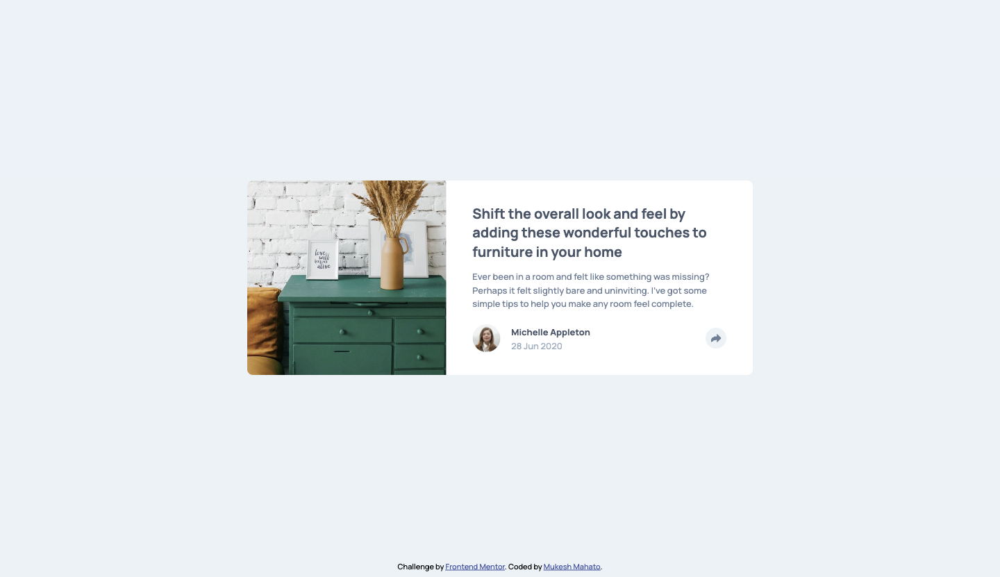
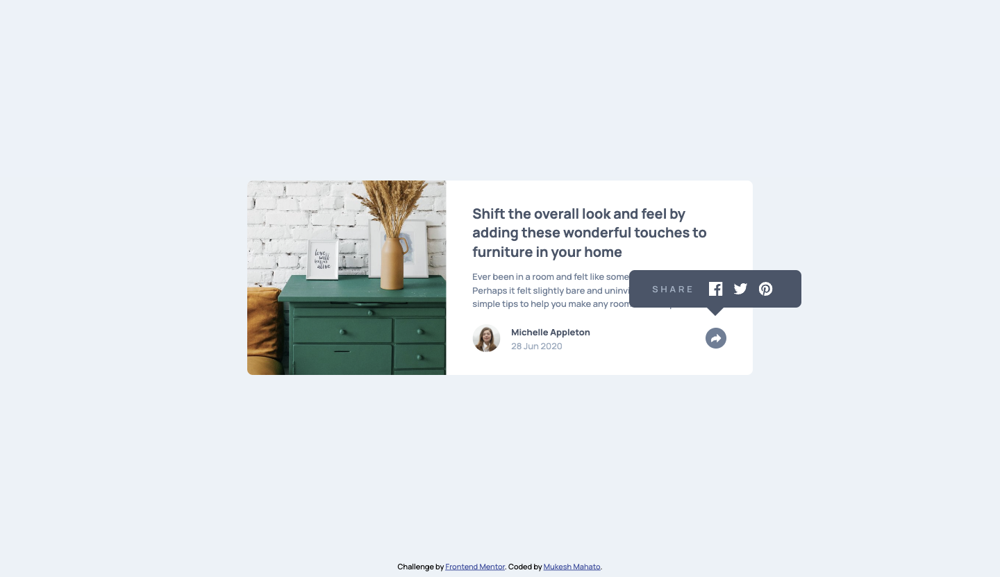
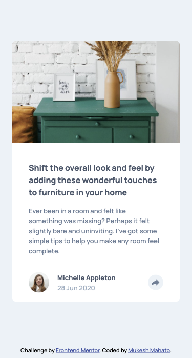
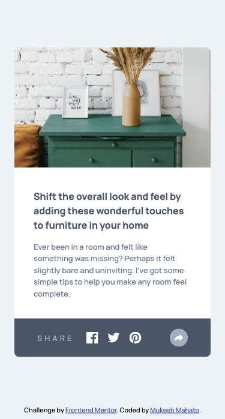

# Frontend Mentor - Article preview component solution

## Table of content

-  [Overview](#Overview)
-  [Screenshot](#Screenshot)
   -  [Desktop Design](#Desktop-Design)
   -  [Desktop Active State](#desktop-design-active-state)
   -  [Mobile Design](#Screenshot)
   -  [Mobile Active State](#Screenshot)
-  [Links](#links)
-  [Build With](#-built-with)
-  [Author](#author)

## Overview

This is a solution to the [Article preview component challenge on Frontend Mentor](https://www.frontendmentor.io/challenges/article-preview-component-dYBN_pYFT). Frontend Mentor challenges help you improve your coding skills by building realistic projects.

## Screenshot

#### Desktop Design

#### Desktop Design Active State

#### Mobile Design

#### Mobile Design Active State

## Links

-  Solution URL: [Click Here](https://www.frontendmentor.io/solutions/nft-preview-card-component-using-html-and-css-owVJujYs59)
-  Live Site URL: [Click Here](https://iammukeshmahato.github.io/article-preview-component)

## ⚙ Built with

-  HTML
-  CSS
-  Flexbox
-  JavaScript

## Author

-  Website - [myselfmukesh.blogspot.com](https://myselfmukesh.blogspot.com/)
-  Frontend Mentor - [@mukeshmahato843](https://www.frontendmentor.io/profile/mukeshmahato843)
-  Facebook - [@iammukeshmahato](https://www.facebook.com/iammukeshmahato)
-  [Message me](https://m.me/iammukeshmahato)
